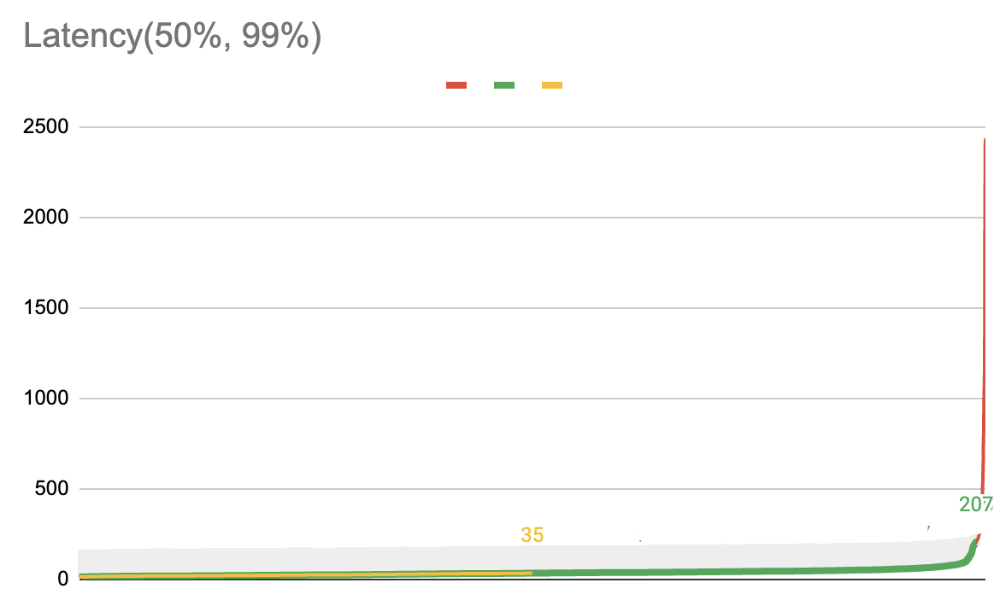

# Report for Homework1 of CS6650

## GitHub Repo

https://github.com/zjdx1998/CS6650/tree/Homework1/Assignment1

## Server

I implemented a full-completed server which can handle every request and return response as https://app.swaggerhub.com/apis/cloud-perf/SkiDataAPI/1.16#/skiers/getSkierResortTotals expected.

## Client Overview

### Design

Client 1 is consist of three parts:

The first part is global arguments processing, where I utilized `args4j` to parse the arguments. I also stored the global variables like `successCount`, `failureCount` which represents the total number of successful and failed requests.

The second part is a runnable class `PhaseThread`, which accepts `int startID, int endID, int startTime, int endTime, int numOfReqs, CountDownLatch latch` as parameter, this is the per client request model.

The third part is main class `client` which has a `static void main` function. This class firstly load the arguments from `Argument` then create a thread pool with total numbers of three phases. All the staticstics data are calculated here.

In addition to Client 1, Client 2 also contains a `csvUtiliizer` class to utilize the data.

### Little's Law Verification

	
  

The above results are generated by `-nt 32 -ns 2000 -nl 40 -nr 10 -test-only -server ec2-54-149-212-65.us-west-2.compute.amazonaws.com` arguments with `-test-only` enabled or disabled. The test only data is calculated by test same number of threads 

We can see the predicted throughput for test-only is $\frac{32}{58.4585} \approx \frac{16003}{55928} = 0.286$,  especially consider three phases of clients using different number of threads.

## Client 1 Statistics

We can see the throughput is linear related to the num of Threads. 

  
  

  
  

The above charts and results are did by `-nt 32 -ns 2000 -nl 40 -nr 10 -server ec2-54-149-212-65.us-west-2.compute.amazonaws.com` with `nt` changes to `32/64/128/256` respectively. 

## Clients 2 Statistics

  
  

We can see both Throughput and mean Latency are linearly related to the number of threads. Consider the default maximum restrictions of Tomcat in AWS EC2 is 200, the first chart contains a inflection point which represents this case.

  
  

  
  

## Bonus

The above chart is ploted for `numThreads=128, numSkiers=20000`, we can clearly see the p50 and p99, but it's not easy to figure out how it's distributed. 

  
  
  
  

Now we know the latency distribution is very interesting which matches well with the actual request layout. This is exactly ploted by average response time for certain time interval bucket. 

All the raw data can be found at [Clients/res/records](Clients/res/records).
